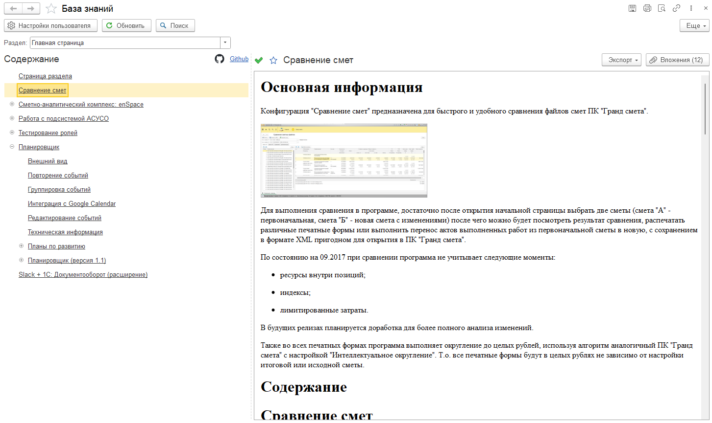

# Обертка над Confluence Cloud API

## Что это?

Это расширение предназначено для простого взаимодействия с API Atlassian Confluence (версия Cloud).
Основано на [официальной публичной документации](https://developer.atlassian.com/cloud/confluence/rest/intro/), [версии api для python](https://github.com/atlassian-api/atlassian-python-api), а также имеет некоторые дополнительные методы для обеспечения удобной работы.

Кроме того, при помощи расширения можно просматривать содержимое базы знаний (с анонимным доступом или с токеном).

## Документация

Документация появится чуть позже. Все методы имеют описание, поэтому пока пользуйтесь ими :).

## Как собрать?

В любой конфигурации создаете расширение и загружаете из файлов каталог `cfe/ConfluenceCloud1C`. Ну или скачиваете из каталога files последнюю сборку.

## Как присоединиться к проекту?

Сразу скажу, я рад любой помощи. Но на текущий момент правил участия не разработано. Поэтому пишите и мы обговорим возможность внесения изменений в расширение.

## Благодарности
* [Atlassian](https://www.atlassian.com/) за разработку прекрасной экосистемы
* [Microsoft](https://github.com/Microsoft/vscode/) за прекрасный и бесплатный VSCode
* [1С](https://v8.1c.ru/) за отличную платформу (пусть и не без глюков)
